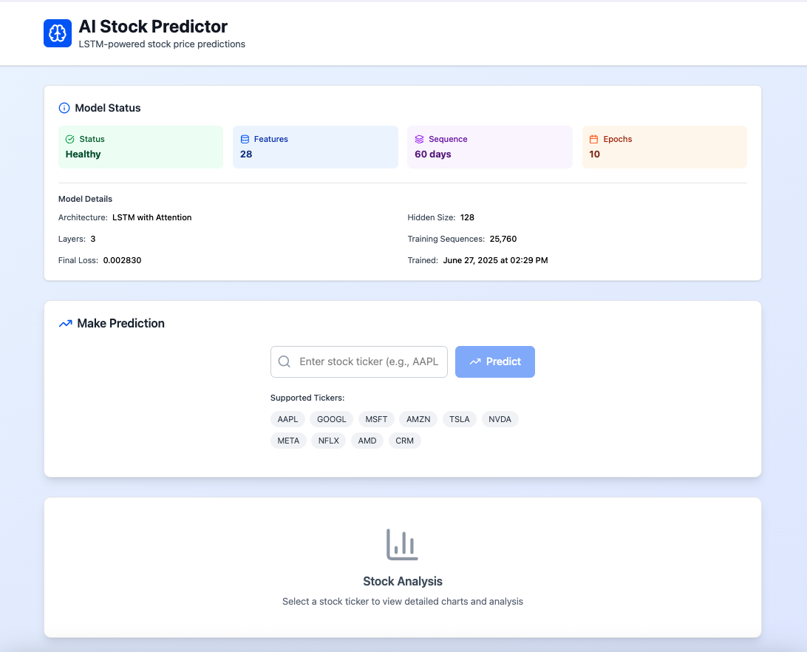
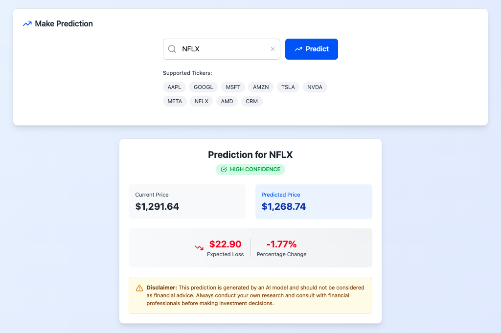
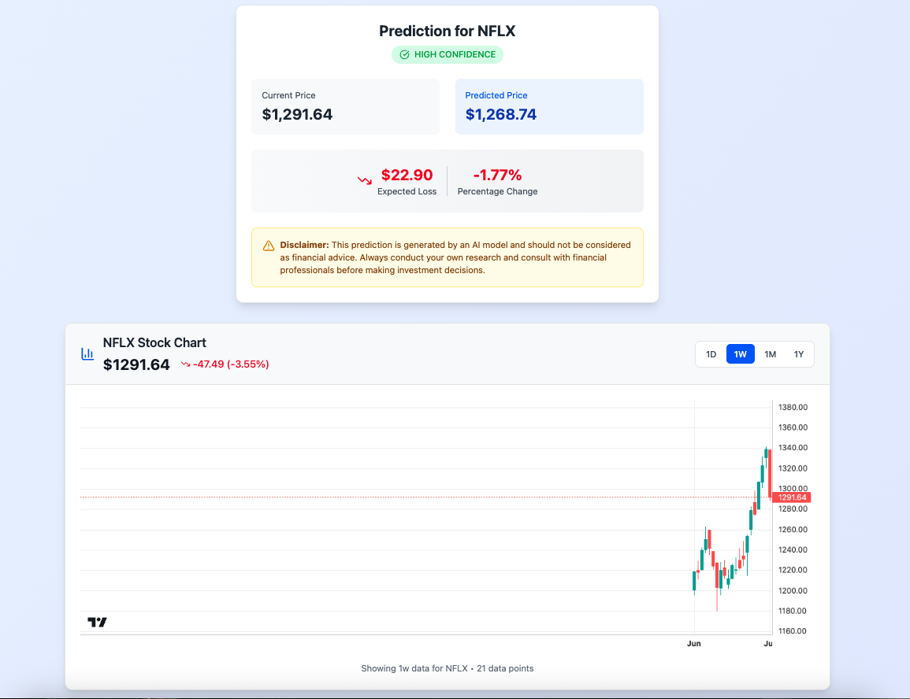
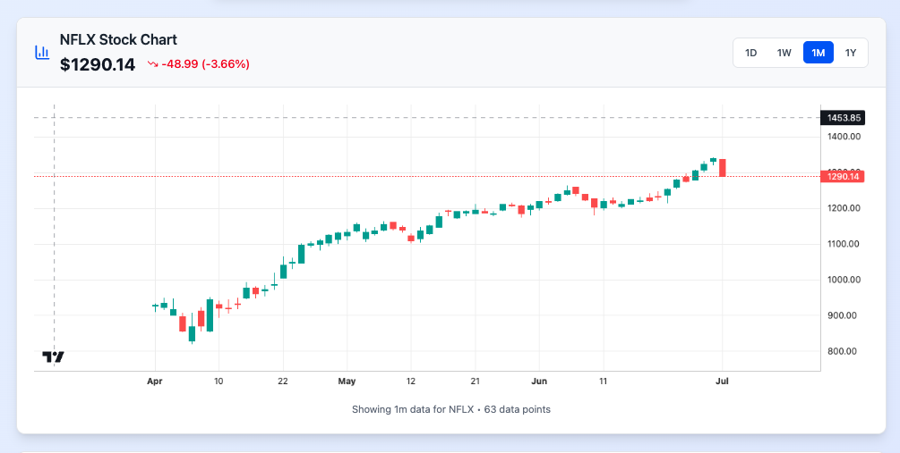
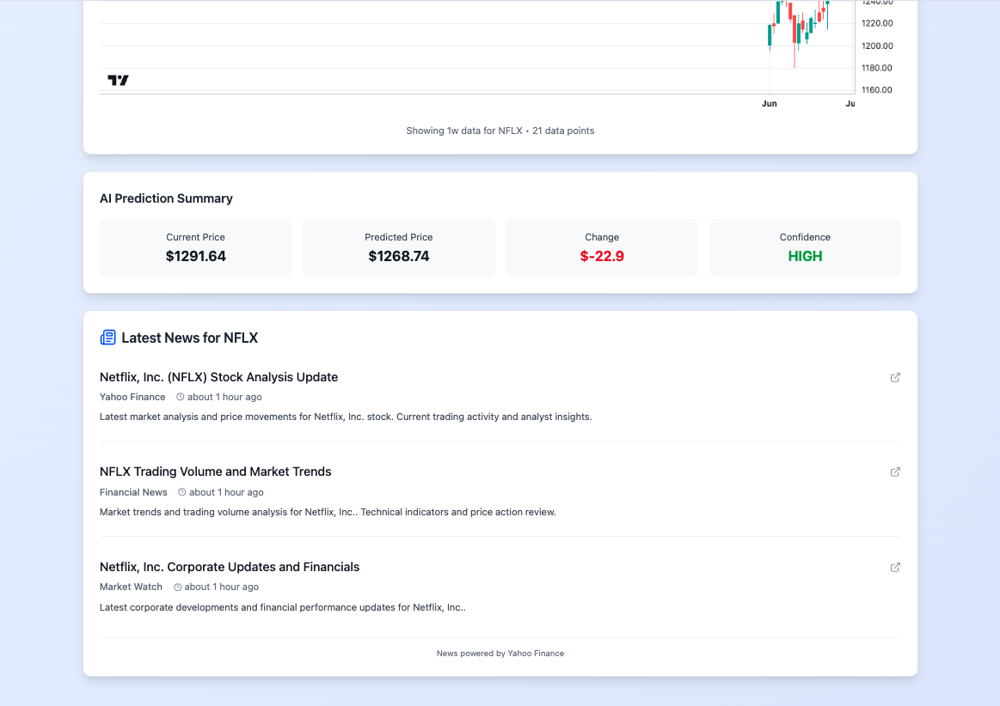

This is a stock prediction tool in python using machine learning. A model is trained with PyTorch. The project is built with FastAPI for backend and React for frontend. The project is depolyed using Docker and NGINX.

This is a practice project for ML and intro to VCd.

To run the project,
in the backend, in one terminal window: uv run python run_server.py
in the frontend, in another terminal window: npm run dev

Edit: Using Docker
1) start docker desktop: open -a Docker
2) end: docker compose down
3) Build and Start the Entire Stack: docker compose up --build -d
4) Verify Everything is Running: docker compose ps
5) Test the Application: curl http://localhost/api/health
6) Test prediction: curl -X POST http://localhost/api/predict \ -H "Content-Type: application/json" \-d '{"ticker": "AAPL", "days_ahead": 1}'
Access Your Application
•  Frontend: Open http://localhost in your browser
•  API: Available at http://localhost/api/*

The nginx reverse proxy handles routing:
•  Frontend at / 
•  API at /api/*

Working Screenshots

